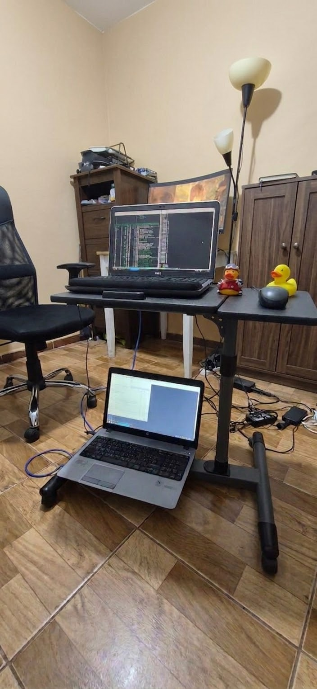

# Cluster

In my journey to become the greatest system engineer, I decided to create a simple compression application using python this app utilizes all CPU cores  to compress any file given to it using gzip compression.

In detail the app first splits the files into 128 MB chunks then distributes the compression work to the CPU cores , after it finishes it reassembles the chunks and gives the full .gz file.

After that I thought to myself this easy work why not do a distributed cluster between two laptop nodes so I can learn how to handle the complexity of distributed work.

So I started by installing Linux mint xfce on two old laptops i had connecting both directly through Ethernet, after that I wrote a simple python socket script to send messages between the two nodes just to test things out.

OK easy work finished now i had to write the code to handle the distributed work, the architecture I ended up with is as the following:

```
                DISTRIBUTED PARALLEL COMPRESSION CLUSTER

                          ┌───────────────┐
                          │   BIG FILE    │
                          │   10+ GB      │
                          └───────┬───────┘
                                  │
                                  ▼
                          ┌───────────────┐
                          │    Laptop 1   │
                          │  Controller   │
                          └───────┬───────┘
                                  │
                            Split into
                              chunks
                                  │
                ┌─────────────────┴─────────────────┐
                │                                   │
                ▼                                   ▼
         LOCAL CHUNKS                        REMOTE CHUNKS
                │                                   │
                │                                   │ TCP
                │                                   ▼
                │                           ┌───────────────┐
                │                           │   Laptop 2    │
                │                           │    Worker     │
                │                           └───────┬───────┘
                │                                   │
                │                           Receive chunks
                │                                   │
                │                                   ▼
                │                         ┌─────────────────┐
                │                         │ ProcessPool     │
                │                         │ Executor        │
                │                         └────────┬────────┘
                │                                  │
                │                    ┌─────────────┼─────────────┐
                │                    ▼             ▼             ▼
                │                  CPU 1         CPU 2         CPU 3 ...
                │                    │             │
                │                    └─────────────┴─────────────┐
                │                                                │
                │                                          Compress
                │                                                │
                │                                                ▼
                │                                       Compressed chunks
                │                                                │
                │                                                │ TCP
                │                                                ▼
                │                                         ┌──────────────┐
                │                                         │   Laptop 1   │
                │                                         └──────┬───────┘
                │                                                │
                ▼                                                │
         ┌───────────────┐                                       │
         │ ProcessPool   │                                       │
         │ Executor      │                                       │
         └───────┬───────┘                                       │
                 │                                               │
      ┌──────────┼──────────┐                                    │
      ▼          ▼          ▼                                    │
    CPU 1      CPU 2      CPU 3 ...                               │
      │          │          │                                    │
      └──────────┴──────────┘                                    │
                 │                                               │
             Compress                                            │
                 │                                               │
                 └──────────────────────┬────────────────────────┘
                                        │
                                        ▼
                              ┌─────────────────────┐
                              │ Compressed Chunks   │
                              │                     │
                              │ 0,1,2,3,4,...       │
                              └──────────┬──────────┘
                                         │
                                  Sort by chunk ID
                                         │
                                         ▼
                              ┌─────────────────────┐
                              │      Merge          │
                              └──────────┬──────────┘
                                         │
                                         ▼
                              ┌─────────────────────┐
                              │   FINAL FILE.GZ     │
                              └─────────────────────┘
```

Node1(laptop1) is a the main server that handles the file split then using two threads it sends half of the work to node2 which also has 2 threads one that receives/sends the chunks and one that compresses these chunks. after node 2 finishes compressing the chunks it sends them back over network to node1 which has a thread waiting to receive the compressed chunks and save toi hard disk to save ram(expensive now a days) and if the first thread in node 1 has already finished compressing its half the program then assembles all chunks from node1 and node2 to create the final result .gz file.  
(for the two nodes the compressing is parallel on the CPU cores to save time)
For a compression algorithm splitting files in to chunks then distribute into two nodes creates overhead so it wasn't really about making something super fast it was about learning how to handle the complexity of organizing chunks of data between two nodes and sending them over network using TCP without mixing the data and joining them again in correct order.

here’s a pic of my perfect cluster:

